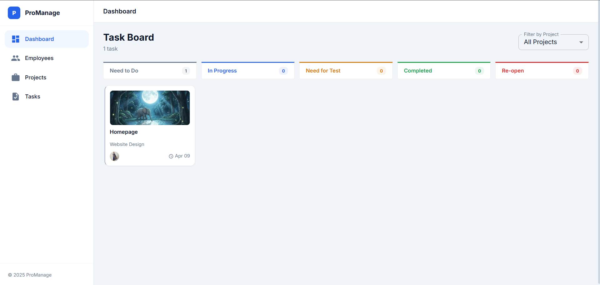
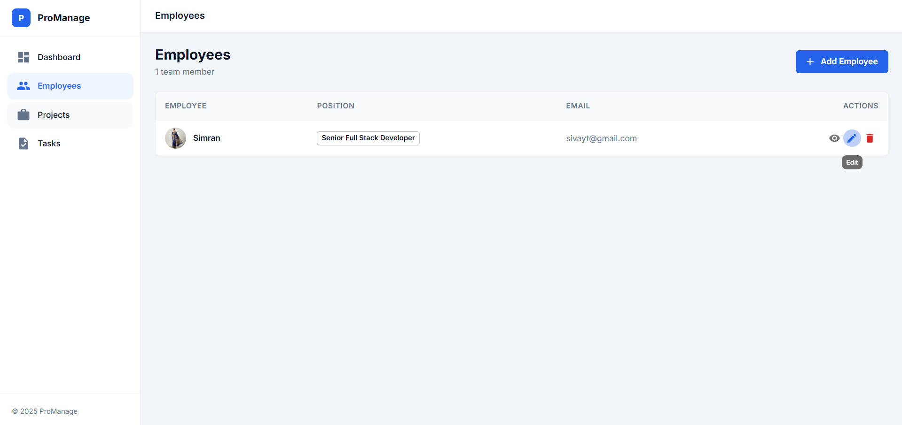
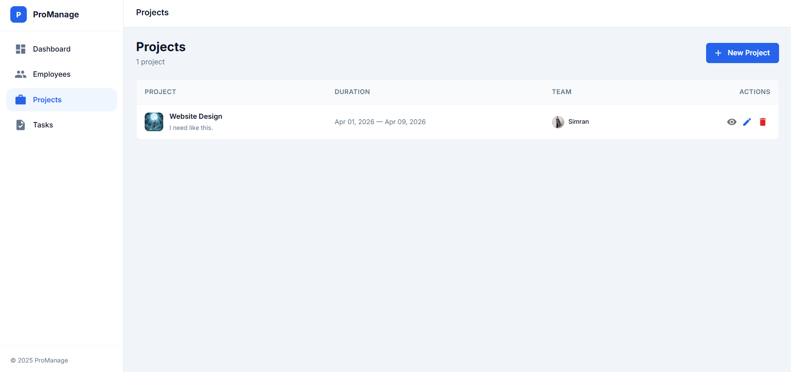
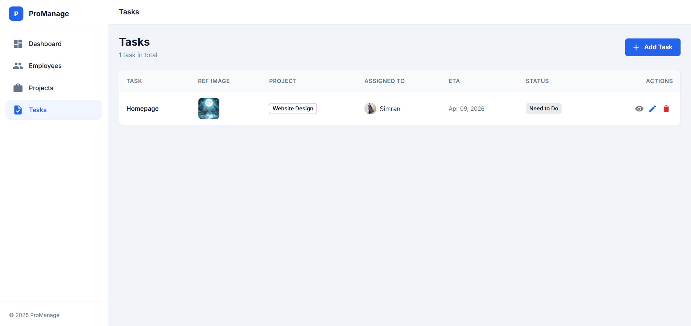

# PowerSoft — Project Management Dashboard

A full-featured **Project Management Dashboard** built with React, Redux Toolkit, and Material UI. Manage employees, projects, and tasks with a beautiful Kanban drag-and-drop board.

---

## 🚀 Live Demo

> [https://projectmanagementpowersoft.netlify.app/](https://projectmanagementpowersoft.netlify.app/)

---

## ✨ Features

### 👥 Employee Management
- Create, View, Edit, Delete employees
- Fields: Name, Position, Official Email (unique), Profile Image
- Email uniqueness validation
- Profile photo via URL

### 📁 Project Management
- Create, View (List + Detail), Edit, Delete projects
- Fields: Title, Description, Logo, Start & End Date/Time, Assigned Employees
- Validation: Start date must be before End date
- Project Detail page shows team, task breakdown, and completion progress

### ✅ Task Management
- Tasks are linked to existing projects only
- Employees selectable only from those assigned to the chosen project
- Fields: Title, Description, Assigned Employee, ETA, Reference Image, Status
- Full CRUD with dialogs

### 📊 Dashboard (Kanban Board)
- 5 columns: **Need to Do · In Progress · Need for Test · Completed · Re-open**
- **Drag & Drop** tasks across columns (status updates automatically)
- Filter tasks by project via dropdown
- Task cards show: title, project name, assigned employee avatar, ETA, reference image thumbnail

---

## 🛠️ Tech Stack

| Layer | Technology |
|---|---|
| Frontend | React 19 (Functional Components + Hooks) |
| State | Redux Toolkit + `react-redux` |
| Routing | React Router DOM v7 |
| Forms | React Hook Form + Yup |
| UI | Material UI v7 |
| Drag & Drop | `@hello-pangea/dnd` |
| Persistence | `localStorage` (survives page refresh) |
| Build | Vite |

---

## 📦 Installation & Setup

### Prerequisites
- Node.js ≥ 18
- npm ≥ 9

### Steps

```bash
# 1. Clone the repository
git clone https://github.com/<your-username>/PowerSoft.git
cd PowerSoft

# 2. Install dependencies
npm install

# 3. Start development server
npm run dev
```

The app will be available at `http://localhost:5173`

### Build for Production
```bash
npm run build
npm run preview
```

---

## 📂 Project Structure

```
src/
├── app/
│   └── store.js                  # Redux store (employees, projects, tasks)
├── components/
│   ├── Layout.jsx                 # Sidebar + main content shell
│   ├── ImageUpload.jsx            # File-based image uploader
│   └── ImageUrlInput.jsx          # URL-based image input with preview
├── features/
│   ├── dashboard/
│   │   └── Dashboard.jsx          # Kanban board with drag-and-drop
│   ├── employees/
│   │   ├── EmployeesList.jsx      # CRUD for employees
│   │   └── employeesSlice.js      # Redux slice + localStorage persistence
│   ├── projects/
│   │   ├── ProjectsList.jsx       # CRUD list for projects
│   │   ├── ProjectDetail.jsx      # Project detail page with tasks & team
│   │   └── projectsSlice.js       # Redux slice + localStorage persistence
│   └── tasks/
│       ├── TasksList.jsx          # CRUD for tasks with project/employee linking
│       └── tasksSlice.js          # Redux slice + localStorage persistence
├── utils/
│   └── imageStore.js              # Handles image data separately in localStorage
├── theme.js                       # MUI theme customization
└── App.jsx                        # Routes definition
```

---

## 🎯 Validation Rules

| Rule | Implementation |
|---|---|
| All fields mandatory | Yup schema on every form |
| Email must be valid & unique | Yup `.email()` + manual duplicate check |
| Start Date < End Date | Yup `.min(yup.ref('startDate'))` |
| Only project-assigned employees selectable for tasks | `availableEmployees` filters by `proj.assignedEmployeeIds` |

---

## 💾 Data Persistence

All data is stored in **`localStorage`**:
- `employees` → employee records (images stored separately)
- `projects` → project records (logos stored separately)  
- `tasks` → task records (reference images stored separately)

Images are stored separately (keyed by `emp_<id>`, `proj_<id>`, `task_<id>`) to avoid the localStorage 5MB size limit on the main data array.

---

## 📸 Screenshots






---

## 📋 Workflow

1. **Add Employees** → Go to Employees, click "Add Employee"
2. **Create a Project** → Go to Projects, click "New Project", assign employees
3. **Add Tasks** → Go to Tasks, click "Add Task", select project → only assigned employees shown
4. **Manage Board** → Dashboard shows Kanban; drag cards to change status; filter by project

---

## 👤 Author

- **Siva** — [GitHub Profile](https://github.com/Sivavg/ProjectManagement)
